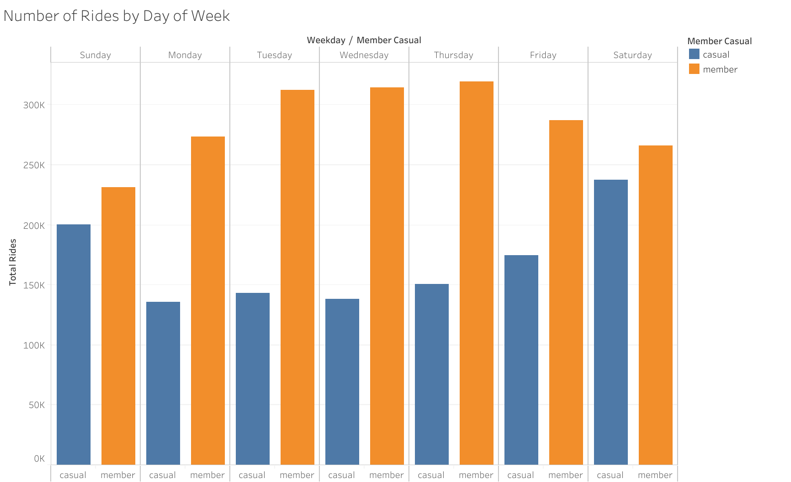
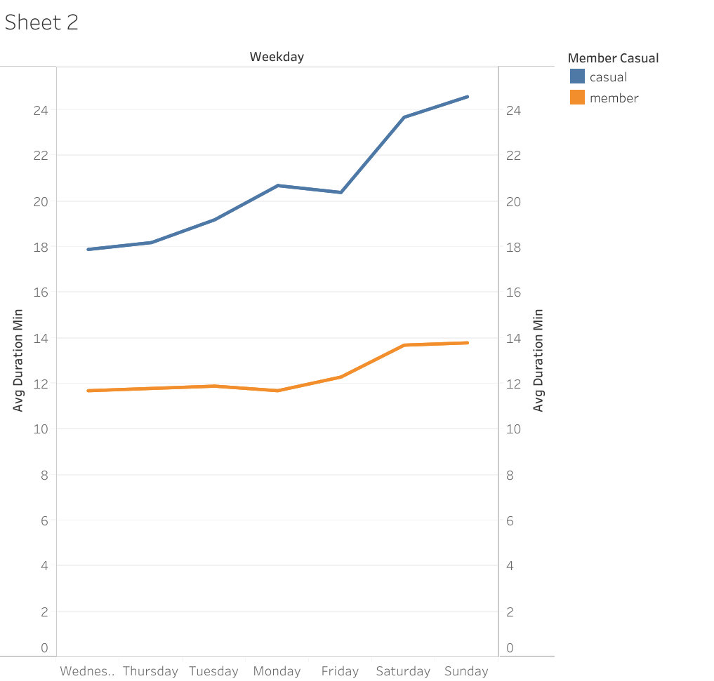
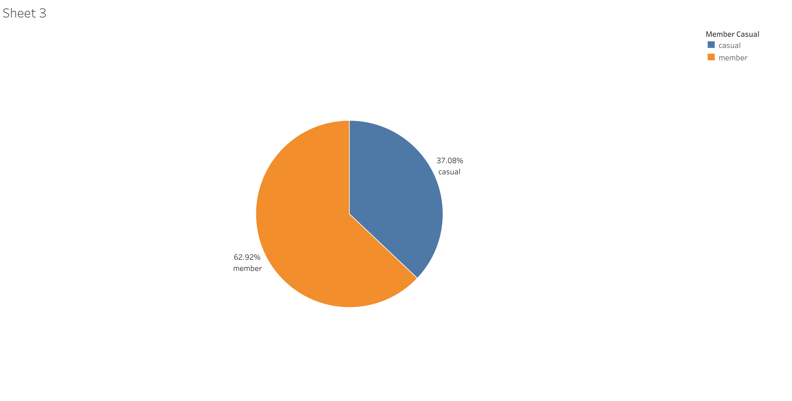
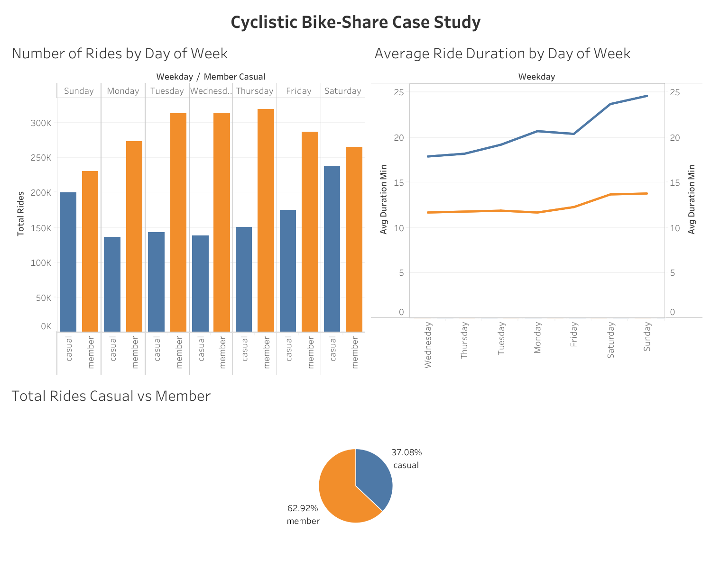

# 🚴‍♀️ Case Study 1: Cyclistic Bike-Share Analysis

### 📘 Overview
This project is part of the **Google Data Analytics Professional Certificate**.  
The goal was to analyze Cyclistic’s bike-share data to understand how casual riders and annual members use bikes differently.

---

### 🧩 Tools Used
- BigQuery
- Tableau 

---

### 🔍 Steps in the Analysis
1. **Ask:** What is the business problem?
   - Understand how annual members and casual riders use Cyclistic bikes differently in order to design marketing strategies aimed at converting casual riders into annual members.
   
2. **Prepare:** 
   - Source: Divvy bike data (public datasets from [divvy-tripdata](https://divvy-tripdata.s3.amazonaws.com/index.html))
   - The dataset consists of 12 monthly CSV files (July 2023 – June 2024) containing 5,818,521 rides from Cyclistic’s historical trip data, made available by Motivate International Inc. under public license. Data is stored locally in  "case_study_1_bike_share/data” containing original CSVs and cleaned versions. The data follows the ROCCC framework and contains no personally identifiable information.
   - ROCCC check:
      + Reliable – First-party data from Cyclistic
      + Original – Directly from bike sensors
      + Comprehensive – Contains all needed fields
      + Current – Last 12 months (Jul 2023–Jun 2024)
      + Cited – Motivate International Inc., licensed for public use
   - Cleaned and combined 12 months of CSV files.

4. **Process:** 
   - Removed missing values and outliers.
   - Added new calculated columns (ride_length, day_of_week, etc.).
   - All queries are listed on the "case_study_1_bike_share/analysis" folder.

5. **Analyze:** 
   - Compared average ride duration and frequency between user types.
   - Identified peak usage times and popular stations.
   - All queries are listed on the "case_study_1_bike_share/analysis" folder.

6. **Share:** 
   - Created visualizations using Tableau.

7. **Act:** 
   - Suggested targeted marketing strategies to increase memberships.

---

### 🖼️ Visuals

---

### 📊 Key Findings
- Casual riders take 91% longer rides on average (23.8 min vs 12.5 min).
- Casuals dominate weekends (43% of their rides vs 28% for members).
- Members ride consistently throughout the week – ideal for commuting.
- Peak casual months: June–August (summer leisure).
- Converting weekend casuals with discounts could increase memberships.

---

### 📢 Top 3 Recommendations
- Weekend-focused membership campaign – Offer a discounted “Weekend Warrior” annual pass at 50% off regular price during summer months to capture high casual weekend usage.
- Long-ride incentive program – Give casual riders a free month of membership after 10 rides longer than 30 minutes (targets their longer average duration).
- Digital media targeting – Run Instagram/Facebook ads on Friday–Sunday showing leisure routes (lakefront, parks) with tagline “Ride all weekend for one low price – upgrade to annual today.”

---

### 💡 Learnings
This case study strengthened my skills in:
- Cleaning large datasets
- Using BigQuery for descriptive analysis
- Building visuals using Tableau to communicate insights

---

### 📁 Repository Structure
- data/ → Raw and cleaned datasets
- analysis/ → BigQuery analysis
- visuals/ → Charts and dashboards
- README.md → Project summary (this file)
